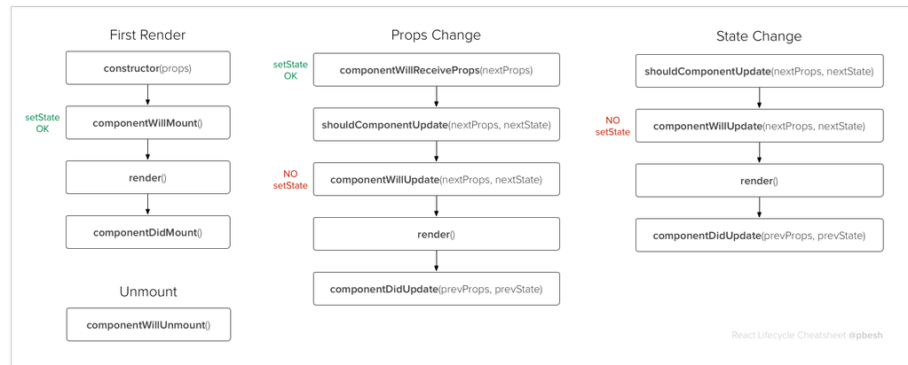

# Lifecycle methods

* Mount / Unmount
* Mounting:    
    * `constructor(props)`
    * `componentWillMount()`
    * `render()`
    * `componentDidMount()`
* Updating (causado por mudanças de `props` ou de `state`):
    * `componentWillReceiveProps(nextProps)`
    * `shouldComponentUpdate(nextProps, nextState): boolean`
    * `componentWillUpdate(nextProps, nextState)`
    * `render()`
    * `componentDidUpdate(prevProps, prevState)`
* Unmounting:
    * `componentWillUnmount()`
* Other API:
    * `setState(updater, [callback])`
        * `updater = Object | (prevState, props) => newState`

## Referências

* https://facebook.github.io/react/docs/state-and-lifecycle.html#adding-lifecycle-methods-to-a-class
* https://facebook.github.io/react/docs/react-component.html