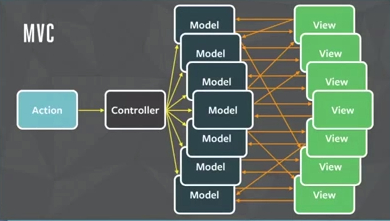

# Redux

## Inspirado no Flux

É uma arquitetura de fluxo unidirecional dos dados.

## Motivação

- Dificuldades no gerenciamento do estado da aplicação em estruturas como MVC
- Ex:
    - Clique em um botão
    - O handler dispara uma alteração no Model A
    - A alteração no Model A dispara outra alteração no Model B
    - A alteração do Model B dispara uma alteração na View B
    - ...

## Princípios :pray:

1. Single Immutable State Tree (single source of truth)
1. State é read-only e só é mutado com Actions (objeto que representa uma mutação de estado)
1. As mutações de estado são realizadas através de uma função pura, chamada `reducer`:
    * `reducer(state, action) => newState`

## Referências

- http://redux.js.org/