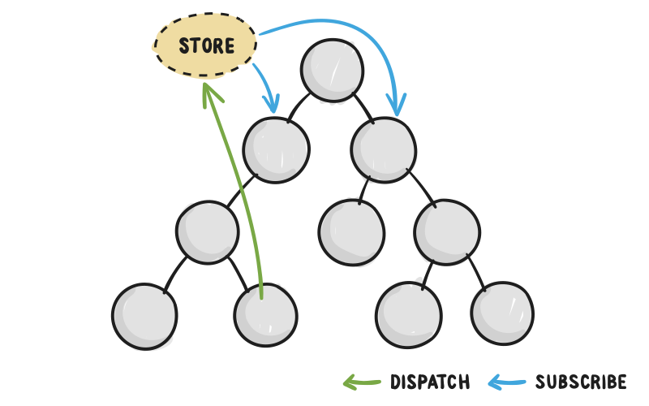

# 1- Primeiro App com Redux

- Store
    - `getState()`
    - `dispatch(action)`
    - `subscribe(listener)`
- Action creators

## Exercício 

~15min

* Adicione a funcionalidade de "decrementar" usando os padrões do Redux.

## Referências

- http://redux.js.org/docs/basics/Actions.html
- http://redux.js.org/docs/basics/Reducers.html
- http://redux.js.org/docs/basics/Store.html
